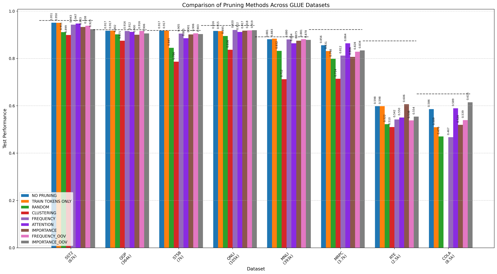
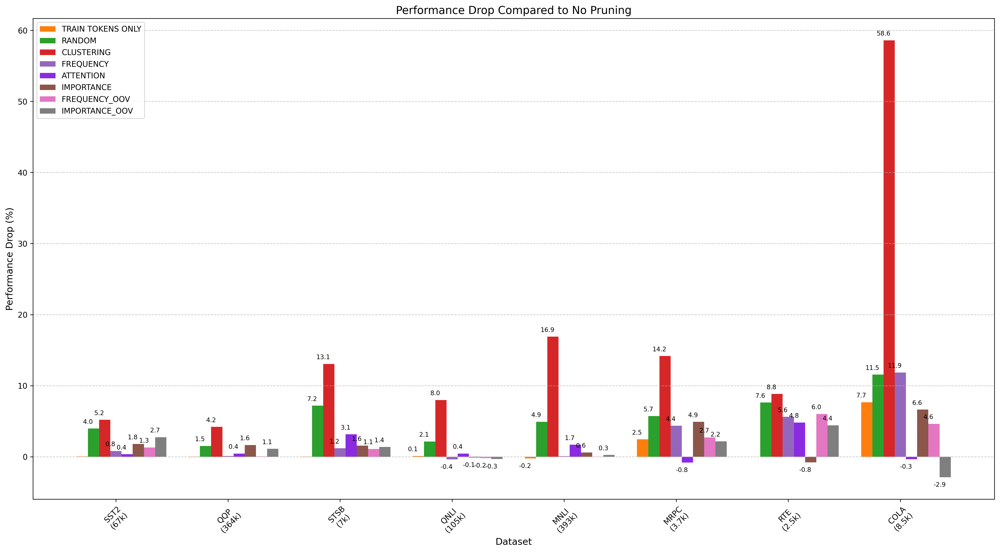
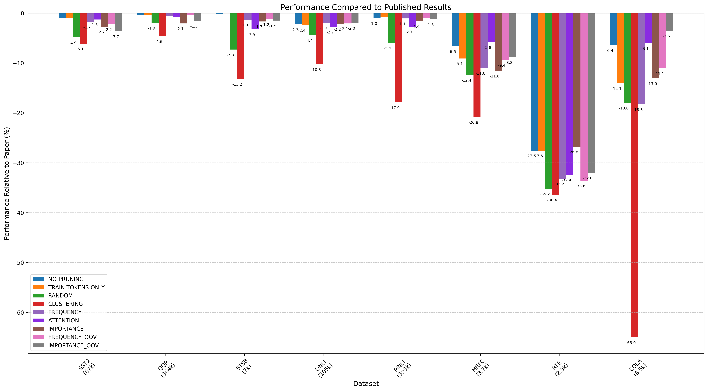
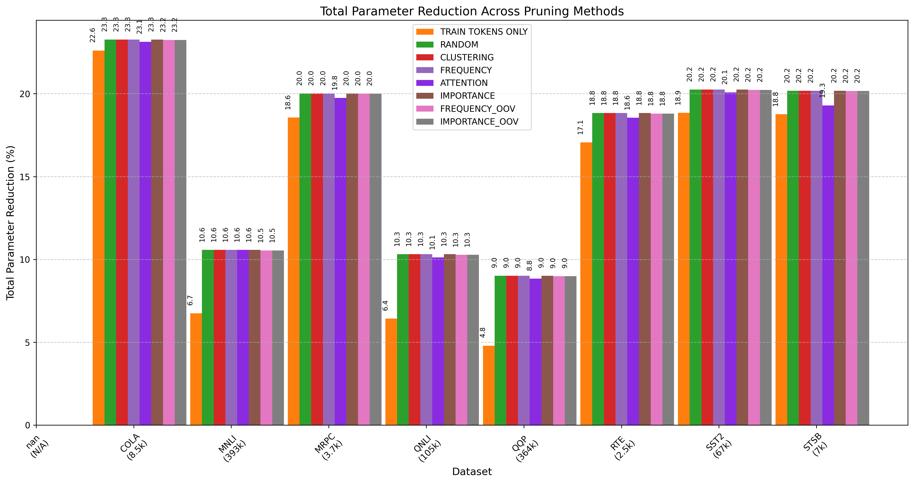
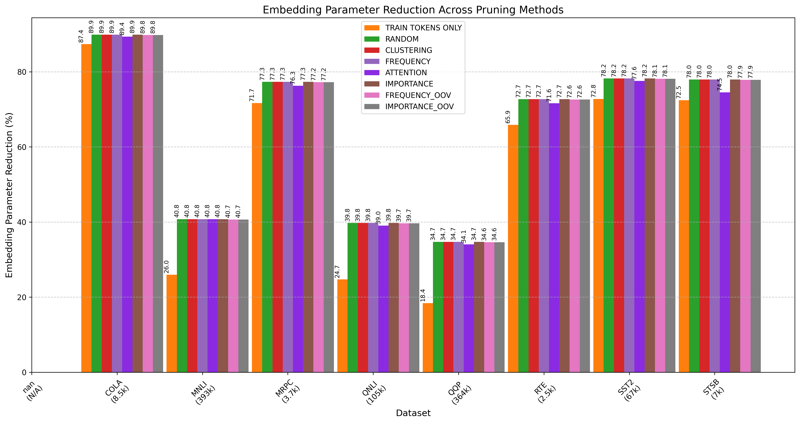

# Plots Documentation

This folder contains visualizations of vocabulary pruning experiments on GLUE benchmark datasets. The visualizations are generated from the results of different pruning methods compared to baseline models.

## Data Sources

All plots are generated from two main data sources:
- `results/SUMMARY.csv`: Contains performance metrics for each dataset and pruning method
- `results/PARAM_REDUCTION_SUMMARY.csv`: Contains parameter reduction statistics for each pruning method

## Performance Comparison Plots

### `pruning_comparison_bar.png`
Compares the test performance of different pruning methods across all GLUE datasets. The plots include:
- NO PRUNING (baseline)
- TRAIN TOKENS ONLY
- RANDOM
- CLUSTERING
- FREQUENCY
- ATTENTION
- IMPORTANCE
- FREQUENCY_OOV
- IMPORTANCE_OOV
- Paper results (shown as dashed lines in the bar chart)

Dataset sizes are indicated below each dataset name.

### `performance_drop.png`
Shows the performance drop (in percentage points) compared to the NO PRUNING baseline for each pruning method across all datasets.

### `paper_comparison.png`
Compares the performance of each pruning method relative to published results from the original papers, measured in percentage points.

## Parameter Reduction Plots

### `total_parameter_reduction.png`
Shows the total parameter reduction (%) achieved by each pruning method across datasets.

### `embedding_parameter_reduction.png`
Specifically shows the embedding parameter reduction (%) achieved by each pruning method.

## OOV (Out-of-Vocabulary) Comparisons

### `frequency_vs_oov.png`
Compares the performance of regular FREQUENCY pruning against FREQUENCY_OOV pruning that preserves Out-of-Vocabulary tokens.

### `importance_vs_oov.png`
Compares the performance of regular IMPORTANCE pruning against IMPORTANCE_OOV pruning that preserves Out-of-Vocabulary tokens.

## Dataset Size Analysis

### `dataset_size_vs_performance_enhanced.png`
Shows the relationship between dataset size and model performance for different pruning methods, including trend lines and correlation coefficients.

**Note**: This plot includes all pruning techniques (NO PRUNING, TRAIN TOKENS ONLY, RANDOM, CLUSTERING, FREQUENCY, ATTENTION, IMPORTANCE, FREQUENCY_OOV, IMPORTANCE_OOV).

## Method-Specific Performance vs. Parameter Reduction

These plots show the trade-off between performance drop and parameter reduction for each specific pruning method:

### `perf_vs_param_random.png`
Performance drop vs. parameter reduction for RANDOM pruning.

### `perf_vs_param_train_tokens_only.png`
Performance drop vs. parameter reduction for TRAIN TOKENS ONLY pruning.

### `perf_vs_param_clustering.png`
Performance drop vs. parameter reduction for CLUSTERING pruning.

### `perf_vs_param_frequency.png`
Performance drop vs. parameter reduction for FREQUENCY pruning.

### `perf_vs_param_attention.png`
Performance drop vs. parameter reduction for ATTENTION pruning.

### `perf_vs_param_frequency_oov.png`
Performance drop vs. parameter reduction for FREQUENCY_OOV pruning.

### `perf_vs_param_importance.png`
Performance drop vs. parameter reduction for IMPORTANCE pruning.

### `perf_vs_param_importance_oov.png`
Performance drop vs. parameter reduction for IMPORTANCE_OOV pruning.

## Experimental Setup

The experiments compare different vocabulary pruning methods on BERT models fine-tuned on GLUE benchmark tasks:
- Datasets: CoLA, SST-2, MRPC, STS-B, QQP, MNLI, QNLI, RTE, WNLI
- Base model: BERT (bert-base-uncased)
- Pruning methods track both test performance and parameter reduction

Each plot is generated in `visualize_results.py` by processing the experiment results. 